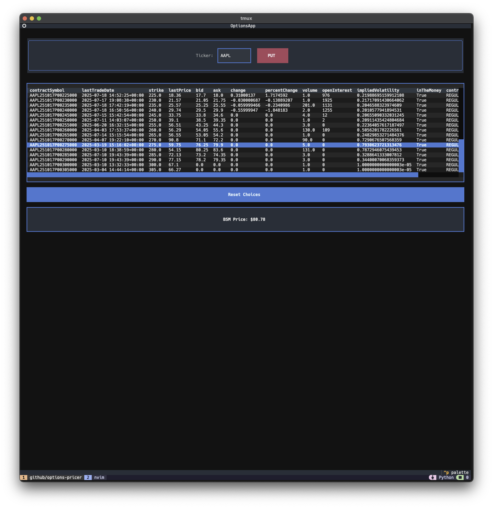

# Options Pricer

Terminal-based options pricing using yahoo finance and the Black-Scholes-Merton (BSM) model to calculate theoretical option prices.
Uses [Textual](https://github.com/Textualize/textual?tab=readme-ov-file#tex) for the UI



## Installation

1. Clone the repo:
```bash
git clone git@github.com:FergusJJ/options-pricer.git && cd options-pricer
```

2. Install requirements:
```bash
pip install -r requirements.txt
```

### Starting/stopping the app

```bash
python main.py
```

*(Use CTRL+Q to exit)*

### Usage

1. Input ticker
2. Toggle between CALL/PUT options via the button
3. Fetch expiration dates and select one from the table
4. Fetch option chain
5. Selcting an option in the table will calculate the theoretical price
